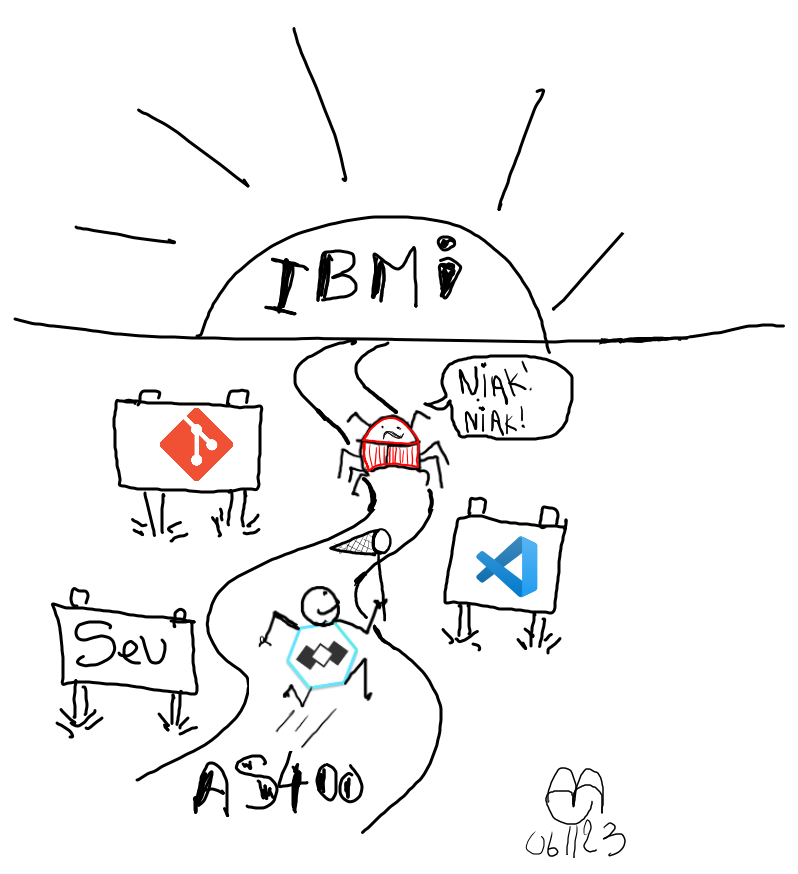

# YABUG : Découverte de code4i
>
> avec vsCode et code4I le code devient une aventure !
> Un outil d'aujourd'hui pour le code de demain !

## Fil rouge

Y a un bug dans ce projet, votre mission si vous l'acceptez est de le trouver et de le corriger.
Bien entendu, vous ne serez pas seul, vous serez accompagné par un expert de la chasse aux bugs.
VsCode et Code4I sont vos amis pour cette mission.  

  

## Objectifs

Cette aventure vous permettra de découvrir les outils de développement modernes pour IBM i.
Ainsi vous allez découvrir comment :

- Installer et configurer Visual Studio Code. (pré-requis)
- Installer et configurer Git. (pré-requis)
- Installer et configurer Code4I.
- Utiliser les outils de développement modernes pour IBM i.
- Découvrir toutes les facettes de Code4I.
- Déboguer un programme RPG avec Code4I.
- Corriger un bug dans un programme RPG avec Code4I.
- Utiliser RPGUnit pour tester un programme RPG.
- Utiliser Git pour gérer les sources RPG.
- Utiliser Gmake pour "builder" les composants de votre projet.
- Utiliser Kroki pour générer des diagrammes à partir de texte et documenter votre projet.
- Utiliser Markdown pour documenter votre projet.
- Utiliser Swagger viewer pour visualiser et tester les APIs REST.

## Le projet

Ce projet est une application de gestion de livres.
Elle permet de :

- lister tous les livres.
- afficher les détails d'un livre.

[description de l'application](ressources/doc/gestionDesLivres.md)

## Pré-Requis

- Accéder à internet.
- Accéder à un IBM i.
  - gmake installé.
  - ssh server lancé.
- Accéder à un dépôt git.
  - git installé.
  - git configuré.
- Accéder à un compte GitHub. (facultatif mais recommandé).
- vscode installé.

## Déroulement

Nous allons suivre les étapes suivantes :

- [Mise en place du Lab](./ressources/lab/01_MiseEnPlace_LAB/README.md)
- Configuration avec codetour.
  - [Start tour](command:codetour.startTour)
- Premier Run de notre projet dans un environnement personnel (DEV) avec codetour.
  - [Start tour](command:codetour.startTour)
- Analyse du cas KO.
- Correction du cas KO.

## Ressources

- [Download Visual Studio Code](https://code.visualstudio.com/download)
- [Download git](https://git-scm.com/downloads)
- [Download IBM i ACS](https://www.ibm.com/support/pages/ibm-i-access-client-solutions)
- [🙏Compte gratuit sur PUB400](https://www.pub400.com/)
- [Code4I gitHub](https://github.com/codefori/vscode-ibmi)
- [code4I docs](https://codefori.github.io/docs/#/)
- [🙏youtube Code for IBM i](https://youtube.com/playlist?list=PLNl31cqBafCp-ml8WqPeriHWLD1bkg7KL&si=gSBHoBYvtTSxMQ_m)
- [youtube Les routes de l'IBMi](https://youtube.com/playlist?list=PL-QeQCtTJK6Esv0Hihg0Mvk87a1KamIV7&si=Nr126mUF7gKmnrF0)
- [iRPGUnit](https://irpgunit.sourceforge.io/)
- [gmake GNU make](https://www.gnu.org/software/make/manual/make.html)

## Instructions de configuration et d'exécution

### Configuration

1. Clonez le dépôt Git de l'application :

```bash
git clone https://github.com/novy400/yabug.git
cd yabug
```

2. Installez les extensions recommandées pour Visual Studio Code. Lorsque vous ouvrez le projet dans VS Code, il vous sera demandé d'installer les extensions recommandées. Acceptez et installez-les.

3. Configurez les variables d'environnement en créant un fichier `.env` à la racine du projet. Vous pouvez utiliser le fichier `.env.example` comme modèle :

```bash
cp .env.example .env
```

4. Modifiez le fichier `.env` pour définir les valeurs appropriées pour votre environnement.

### Exécution

1. Ouvrez le projet dans Visual Studio Code :

```bash
code .
```

2. Lancez la tâche de construction pour compiler les composants de l'application. Vous pouvez utiliser la commande suivante dans le terminal intégré de VS Code :

```bash
gmake
```

3. Déployez l'application sur votre IBM i en utilisant la commande suivante :

```bash
ici --cmd "mkdir -p './builds/ics_${GITHUB_HEAD_REF}'" --rcwd "./builds/ics_${GITHUB_HEAD_REF}" --push "." --cmd "/QOpenSys/pkgs/bin/gmake LIBL= ${{ secrets.DEV_LIBL }} BIN_LIB= ${{ secrets.USER_LIB }}"
```

4. Exécutez les tests automatisés pour vous assurer que l'application fonctionne correctement :

```bash
gmake tst
```

## Exemples d'utilisation

### Lister tous les livres

Pour lister tous les livres, exécutez le programme `LIVRELST` :

```bash
CALL PGM(LIVRELST)
```

### Afficher les détails d'un livre

Pour afficher les détails d'un livre, exécutez le programme `LIVREDET` en fournissant le code du livre en paramètre :

```bash
CALL PGM(LIVREDET) PARM('1')
```

## Code de conduite

Nous nous engageons à fournir un environnement de collaboration ouvert et accueillant pour tous les contributeurs. Veuillez consulter notre [Code de conduite](CODE_OF_CONDUCT.md) pour plus de détails.

## Directives de contribution

Nous apprécions les contributions de la communauté. Pour en savoir plus sur la façon de contribuer, veuillez consulter nos [Directives de contribution](CONTRIBUTING.md).

## TODO

- [ ] ajouter une image avec le logo des routes de l'IBMi et CODE4i.

aie
