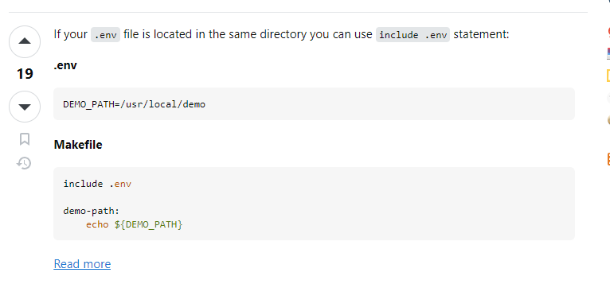

# Gestion des employés.

## Pré-Requis

## Install and Build
1. `git clone https://github.com/novy400/gestionErreur.git` this repository

1. Run `make BIN_LIB=YOURBIB` (available from yum) en remplaçant YOURBIB par votre bibliothèque.
 

## Process 

## Ressources
## TODO
- [ ] TODO: readme generator
- [ ] TODO: Refactoring ?
- [ ] TODO: test profil test
- [ ] TODO: doc avec kroki
- [ ] TODO: test peek et goto
- [ ] TODO: recherche
- [ ] TODO: codetour pour ajout rpgunit test case
- [ ] TODO: écrire le scénario de test
- [ ]    procedure detail dans le service
- [ ] faire commandes pour appel procédure de service
- [ ] ajouter des variables d'environnement pour les chemins 
  

md to pdf : https://www.markdowntopdf.com/