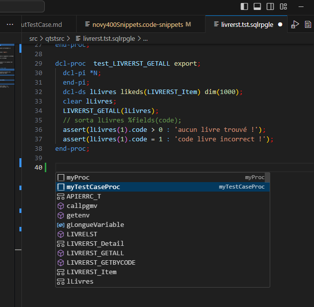
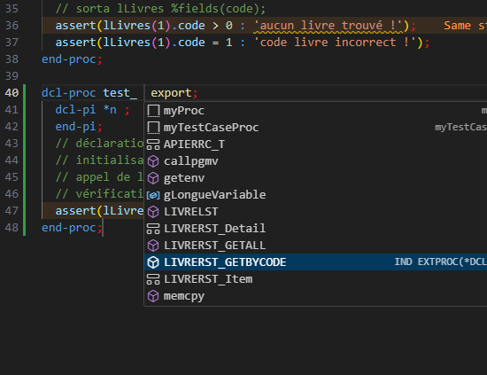
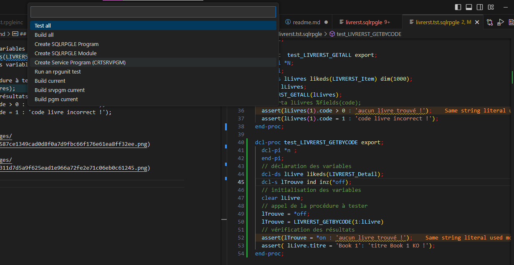
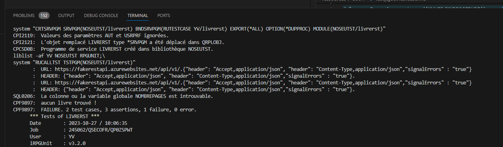

## ajout d'un test case avec rpgunit
## Test ajout d'un test case avec rpgunit

### Description
Teste si la méthode `ajouterTestCase` ajoute correctement un nouveau test case à la suite de tests.

### Prérequis
- Avoir initialisé une instance de la classe `RpgUnit`.
- Avoir créé un test case valide.

### Étapes
1. Ajouter le test case à la suite de tests en appelant la méthode `ajouterTestCase`.
2. Exécuter la suite de tests en appelant la méthode `executerTests`.

### Résultat attendu
La suite de tests doit s'exécuter sans erreur et le nouveau test case doit être inclus dans la suite de tests.

### Code de test


## ajout d'un cas de test pour le detail d'un livre
```rpgle
LIVRERST_GETBYCODE(10);
```
ouvrir [le programme de test](../../src/qtstsrc/livrerst.tst.sqlrpgle) et ajouter un test case à la suite de tests.

```rpgle
dcl-proc  test_<nom_du_test> export;
  dcl-pi *N; 
  end-pi;
  // déclaration des variables  
  dcl-ds lLivres likeds(LIVRERST_Item) dim(1000);
  // initialisation des variables  
  clear lLivres;
  // appel de la procédure à tester  
  LIVRERST_GETALL(lLivres);
  // vérification des résultats  
  assert(lLivres(1).code > 0 : 'aucun livre trouvé !');
  assert(lLivres(1).code = 1 : 'code livre incorrect !');
end-proc;
```
  

  

lancement 
  

  
