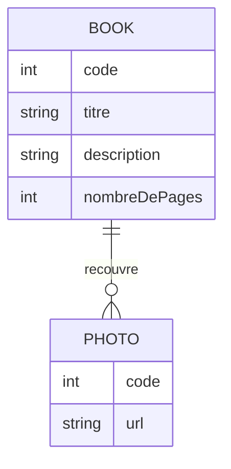
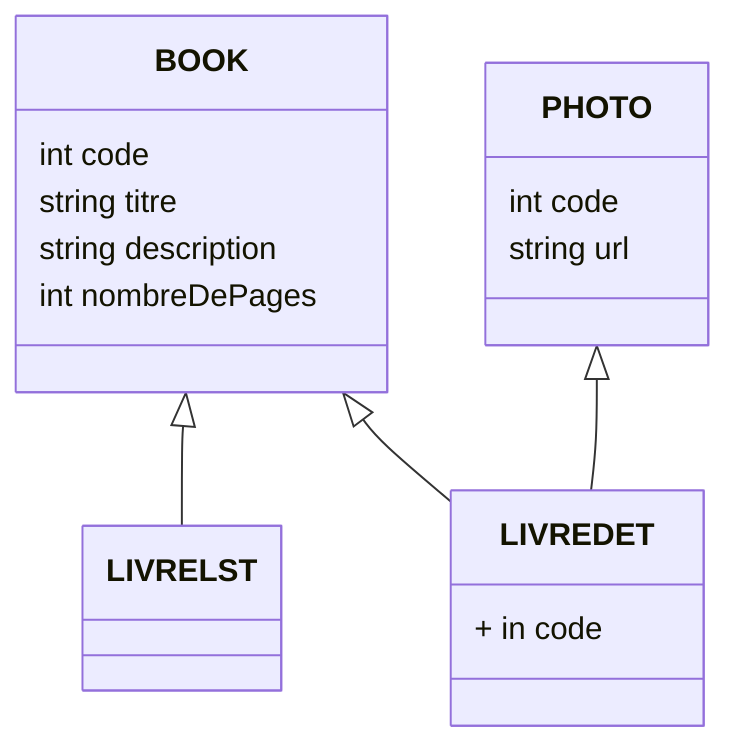
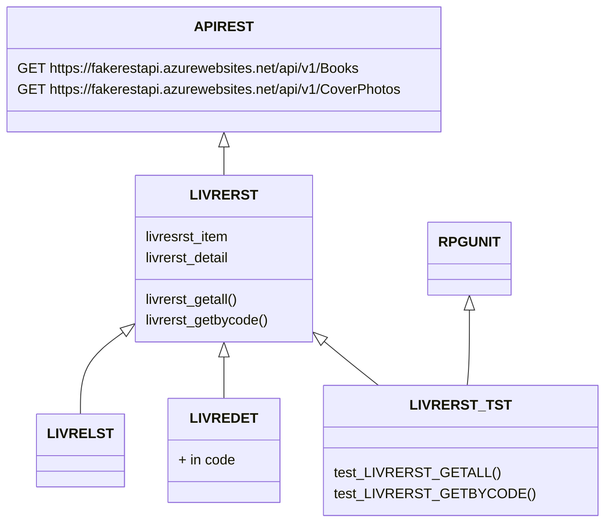

# Gestion des livres

la gestion des livres permet : 
- de lister tous les livres.
- d'afficher les détails d'un livre.

Cette application utilisait anciennement des tables internes pour stocker les livres.

## Ancienne architecture

## Modernisation de l'architecture

Cette table a été remplacée par l'appel d'une API externe.
Cette API est exposée sous la forme de web services de type REST.   
[FakerestAPi](https://fakerestapi.azurewebsites.net/index.html)

## Nouvelle architecture
