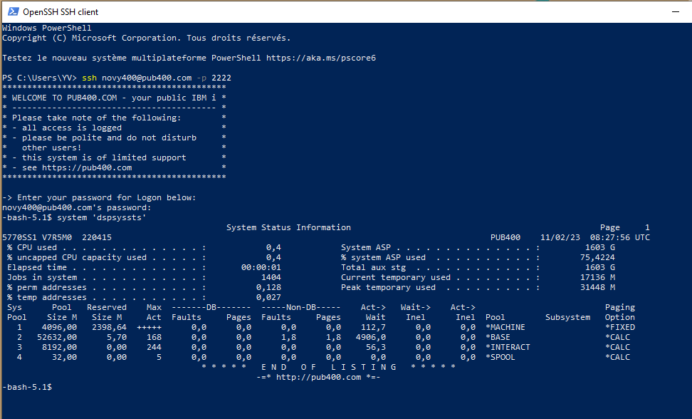
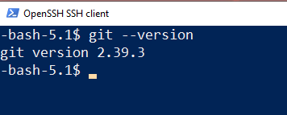
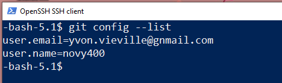
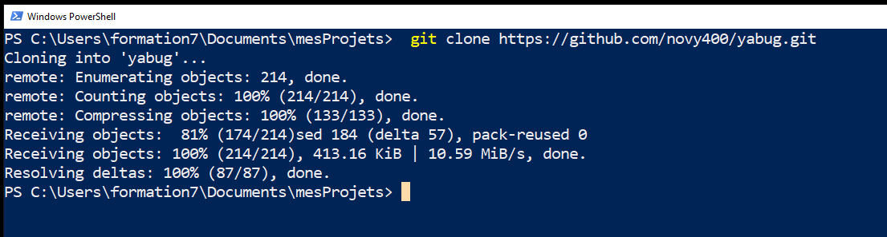
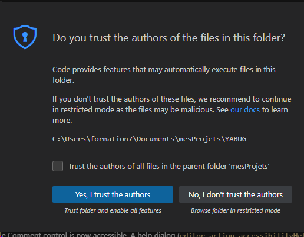
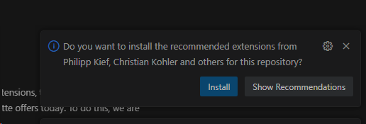
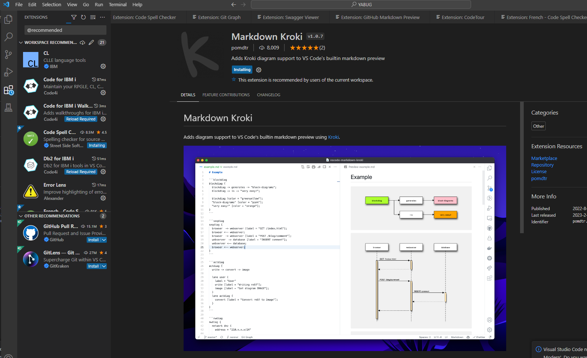
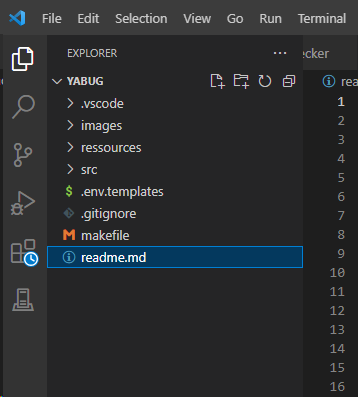
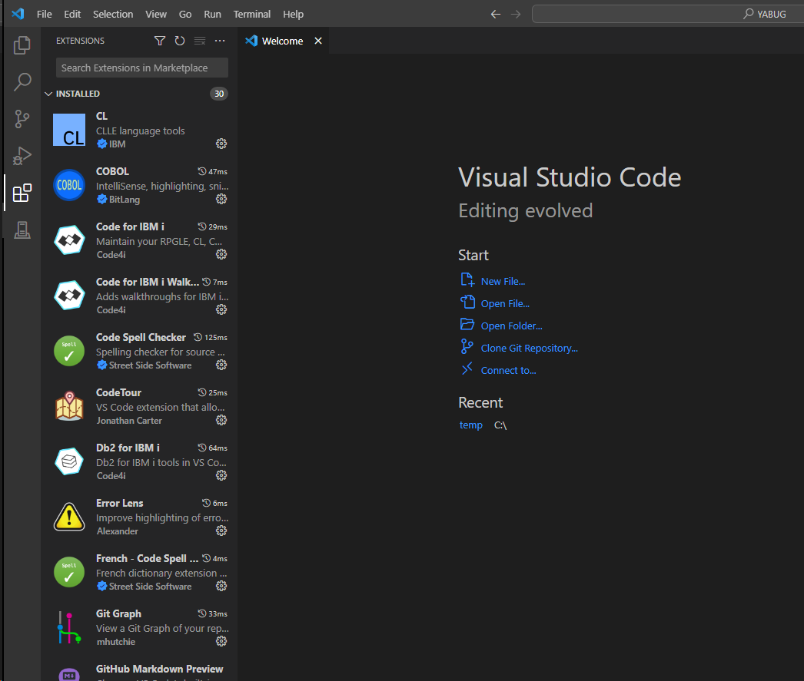

# Mise en place du lab. 
## Table des matières
- [Objectifs](#objectifs)  
- [Pré-Requis](#pré-requis)  
- [Ressources](#ressources)  
- [Guide](#guide)
# Objectifs  
- Valider les pré-requis.
- Télécharger le projet de notre application depuis Github.
- Ouvrir notre projet dans Visual Studio Code. 
- Entrer dans l'aventure "YABUG".

# Ressources  
- [Download Visual Studio Code](https://code.visualstudio.com/download)  
- [Download git](https://git-scm.com/downloads)
- [Download IBM i ACS](https://www.ibm.com/support/pages/ibm-i-access-client-solutions)  
- [🙏Compte gratuit sur PUB400](https://www.pub400.com/)  
# Pré-Requis  
- Accéder à internet. 
- Accéder à un profil sur un IBMi via ssh.
- vscode installé sur votre poste.
- git installé sur votre poste.
- git configuré avec votre compte. 

# Guide  
## Etape 0 - Valider les pré-requis.
1. Accéder à un profil sur un IBMi via ssh.
    - Ouvrir un shell (powershell pour windows par exemple) 
    - Se Connecter à votre profil IBMi via SSH:
        - Remplacer **<profil>** par votre profil IBMi.  
        - Remplacer **<hostnameIBMi>** par le nom d'hôte de votre IBMi.
        - Ajouter -p 2222 pour pub400.com (port du ssh) sinon ne pas mettre de port.

        ```console
            ssh <profil>@<hostnameIBMi> -p 2222
        ```
      

1. Configurer git sur votre poste.  
    - Ouvrir un shell (powershell pour windows par exemple) 
    - Vérifier que git est bien installé.  
    ```console
        git --version
    ```
       
      - si KO  
        - installer git sur votre poste.  
        - [Download git](https://git-scm.com/downloads)
    - Vérifier la configuration de votre compte dans git.
    ```console
        git config --list
    ```  

        

      - si KO  
        - configurer git avec votre compte. 
        ```console
                git config --global user.name "John Doe"
                git config --global user.email "johndoe@example.com"
        ```  

## Etape 1 - Télécharger le projet de notre application depuis Github.
  - Ouvrir un shell (powershell pour windows par exemple)
  - Se placer dans son répertoire de projets.  
  ```console
    cd <répertoire de travail>
  ```
  - cloner le dépôt git de notre application **YABUG**.  
  ```console
    git clone https://github.com/novy400/yabug.git
  ``` 
  

## Etape 2 - Ouvrir notre projet dans Visual Studio Code.  
  - Ouvrir un shell (powershell pour windows par exemple)
  - Se placer dans sur notre projet.  
  ```console
    cd <répertoire de YABUG>
  ```
  - Ouvrir notre projet dans Visual Studio Code.  
  ```console
    code .
  ```
  - faire confiance !   
  
  - installer les extensions recommandées.  
  
  - patienter pendant l'installation des extensions.  
  
 
- relancer vsc via la touche **reload** devant une extension.
  

## Etape 3 - Entrer dans l'aventure "YABUG".
//TODO: un petit coup de pub pour YABUG via un dessin animé.😀
1. suivre le guide.

## Conclusion et feed-back  

## Correction  


# 💡💡💡💡Idées 
- 